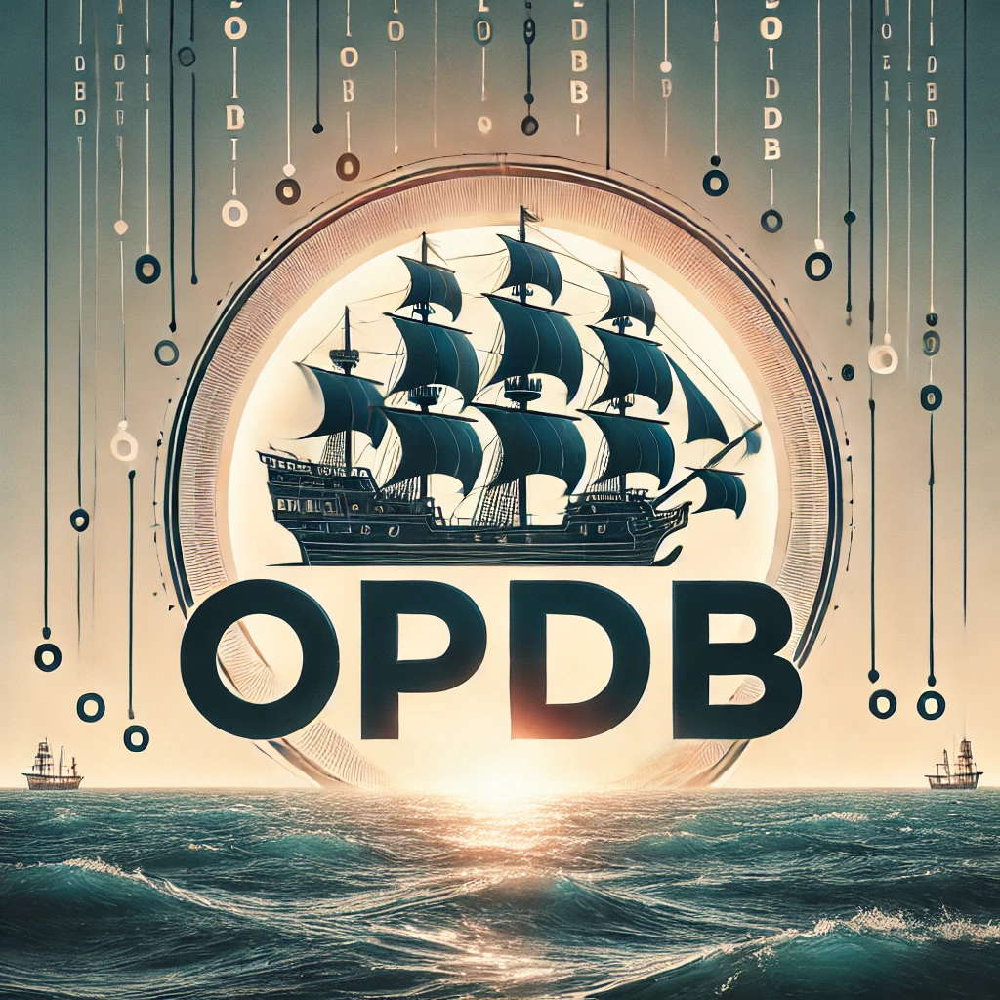

<div align="center">
  <h1>OPDB</h1>
  <p>
    <strong>One Piece data repository (through web scraping) and API in Rust!</strong>
  </p>
  <p>


[](https://codecov.io/gh/muhrifqii/opdb-rust)


</p>
</div>

## About

### What is OPDB?

OPDB is a Rust-based project that scrapes data from the One Piece Wiki to create a structured and accessible data repository for the One Piece universe. It provides an API to access detailed information about devil fruits, pirate crews, ships, and more.

Whether you're a fan, developer, or researcher, OPDB makes it easy to explore the world of One Piece programmatically.

### Stack

- [Rust](https://www.rust-lang.org/) - The core programming language for the project.
- [Tokio](https://tokio.rs/) - For asynchronous runtime.
- [Scraper](https://docs.rs/scraper/) - For HTML parsing and web scraping.
- [Serde](https://serde.rs/) - For data serialization and deserialization.

---

## Features

- **Devil Fruits**: Detailed information about Paramecia, Zoan, and Logia types, including subtypes like Ancient and Mythical Zoan.
- **Pirate Crews**: Data about pirate crews, their captains, and affiliated ships.
- **Ships**: Information about ships, including their status, affiliation, and images.
- **Non-Canon Detection**: Identify whether a pirate crew, ship, or devil fruit is canon or non-canon.
- **JSON Output**: Export scraped data in JSON format for easy integration with other tools.

---

## Installation

1. **Clone the Repository**:
   ```bash
   git clone https://github.com/muhrifqii/opdb-rust.git
   cd opdb-rust
   ```

2. **Install Rust**:
   Ensure you have Rust installed. If not, install it via [rustup](https://rustup.rs/):
   ```bash
   curl --proto '=https' --tlsv1.2 -sSf https://sh.rustup.rs | sh
   ```

3. **Build the Project**:
   ```bash
   cargo build --release
   ```

---

## Usage

1. **Run the Scraper**:
   ```bash
   cargo run --release -- --output <output_directory>
   ```
   Replace `<output_directory>` with the path where you want the scraped data to be saved. If not specified, the default directory is `data`.

2. **Access the Data**:
   The scraped data will be saved as JSON files in the specified output directory. For example:
   - `df_type_infos.json`: Information about devil fruit types.
   - `df_list.json`: List of all devil fruits.
   - `pirates.json`: Details about pirate crews.
   - `ships.json`: Information about ships.

---

## Future Plans

- **API Server**: Add a RESTful API to serve the scraped data dynamically.
- **Enhanced Scraping**: Support for additional One Piece data, such as characters, locations, and battles.
- **GraphQL Support**: Provide a GraphQL API for more flexible queries.
- **Web Interface**: Build a web-based UI for exploring the data visually.
- **Data Validation**: Improve data accuracy by cross-referencing multiple sources.

---

## Contributing

Contributions are welcome! If you have any ideas or suggestions, please open an issue or submit a pull request.

### How to Contribute
1. Fork the repository.
2. Create a new branch for your feature or bugfix.
3. Submit a pull request with a clear description of your changes.

---

## License

This project is licensed under the MIT License - see the [LICENSE](LICENSE) file for details.

Data is scraped from [One Piece Wiki](https://onepiece.fandom.com/wiki) and is licensed under [CC BY-SA 4.0](https://creativecommons.org/licenses/by-sa/4.0/).
